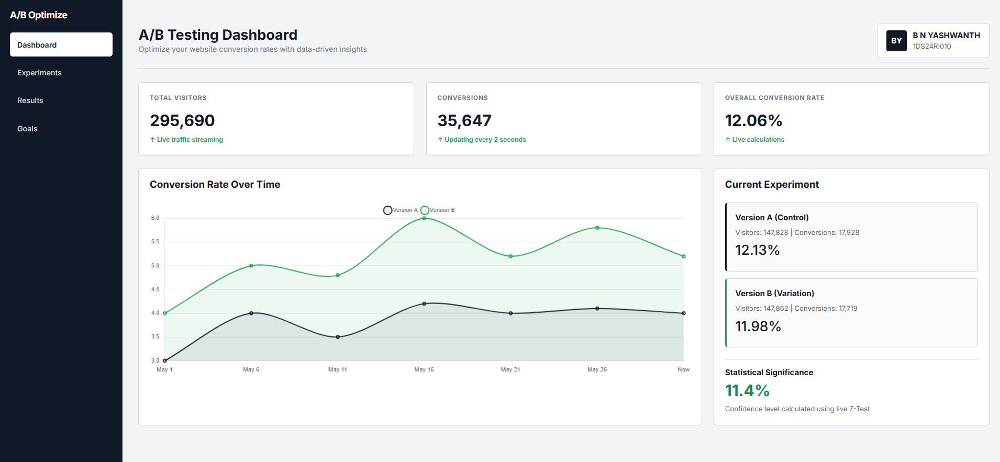
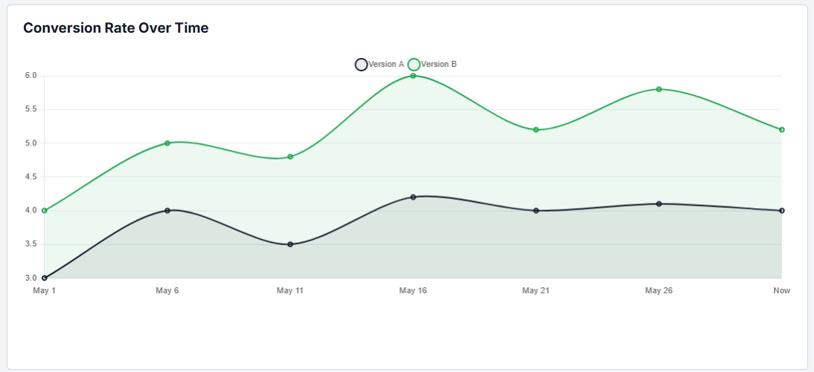
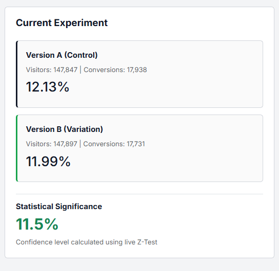
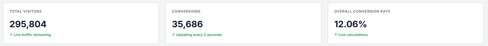
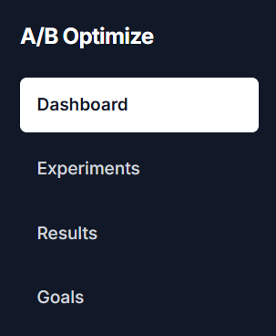

# A/B Testing Analytics Dashboard & Statistical Engine

A full-stack, data-driven web application designed to analyze A/B test results dynamically. This dashboard processes large-scale datasets, simulates live web traffic updates, and calculates statistical significance using mathematical Z-Tests for conversion optimization experiments.

---

## Dashboard Preview

### Full Dashboard Overview


### Conversion Analytics Chart


### Experiment Results Panel


### Real-Time Metrics Cards


### Sidebar & Navigation UI


---

## Features

* Real-Time Data Ingestion using Pandas
* Live Statistical Significance Calculation with Z-Test
* Dynamic Polling System updating every 2 seconds
* Interactive Conversion Rate Visualization using Chart.js
* Responsive Dashboard UI built with Bootstrap 5
* Modular Flask Backend Architecture
* A/B Experiment Comparison Engine
* Conversion Tracking & Confidence Analysis

---

## Technologies Used

### Backend

* Python 3
* Flask
* Pandas
* Statsmodels

### Frontend

* HTML5
* CSS3
* JavaScript
* Bootstrap 5
* Chart.js

---

## Project Structure

```text
ab_dashboard/
│
├── app.py
├── ab_data.csv
├── requirements.tx t
├── vercel.json
├── README.md
│
├── images/
│   ├── dashboard-overview.png
│   ├── conversion-chart.png
│   ├── experiment-results.png
│   ├── metrics-cards.png
│   └── sidebar-navigation.png
│
└── templates/
    └── index.html
```

---

## Installation & Setup

### Clone the Repository

```bash
git clone https://github.com/your-username/ab-optimize-dashboard.git
```

### Navigate to the Project Directory

```bash
cd ab-optimize-dashboard
```

### Install Dependencies

```bash
pip install -r requirements.txt
```

### Run the Flask Application

```bash
python app.py
```

### Open in Browser

```text
http://127.0.0.1:5000/
```

---

## Core Analytical Logic

### Conversion Rate Formula

```text
Conversion Rate = (Total Conversions / Total Visitors) × 100
```

The dashboard continuously updates visitor and conversion metrics in real time.

---

### Statistical Significance (Z-Test)

The backend uses `statsmodels.proportions_ztest` to determine whether Version B truly outperformed Version A or if the observed results occurred by random chance.

The engine:

* Calculates p-values
* Computes confidence levels
* Compares conversion performance
* Generates live statistical insights

---

## Dataset Insights

| Variant               | Visitors | Conversions | Conversion Rate |
| --------------------- | -------- | ----------- | --------------- |
| Version A (Control)   | 147,724  | 17,896      | 12.11%          |
| Version B (Variation) | 147,766  | 17,684      | 11.97%          |

### Analysis

The control group slightly outperformed the variation. The statistical confidence for Version B winning is approximately **11%**, indicating that the new variation does not significantly outperform the original design.

---

## Future Improvements

* MongoDB Atlas integration for live event tracking
* User authentication system
* Experiment history and filtering
* Sample Size Calculator
* Advanced analytics reports
* Exportable PDF experiment summaries

---

## Deployment

This project is configured for deployment using Vercel.

### Deploy Command

```bash
vercel deploy
```

---

## Author

**B N YASHWANTH**
ID: 1DS24RI010

### GitHub

https://github.com/bnyashwanth

### LinkedIn

https://linkedin.com/in/bnyashwanth
